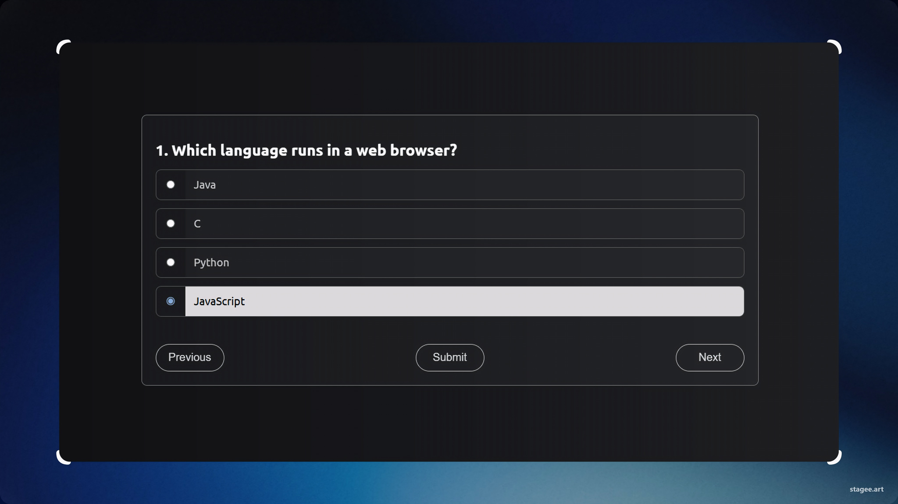

# 🧠 Quiz App

A **JavaScript Quiz App** built using **vanilla JS** as part of **Harkirat’s Cohort 3.0 (Week 3: DOM Manipulation & State Management)**. The app dynamically renders questions, tracks answers, and displays the final score, all while providing an interactive, responsive experience.

---

## 🚀 Features

- 🧩 **Dynamic Question Rendering**: Questions are rendered dynamically using JavaScript DOM APIs.
- 🖱️ **Interactive Radio Options**: Select answers with radio buttons that provide live highlight on hover.
- 🔄 **Next / Previous Navigation**: Seamless navigation between questions without page reloads.
- ✅ **Score Calculation**: Tracks user attempts, correct answers, and displays final score on submission.
- 🧠 **Retake Option**: Reset and retake the quiz for better practice.
- 📱 **Responsive & Mobile-Friendly**: Fully responsive design that works on both desktop and mobile devices.

---
## 🌐 Live Demo  
👉 [Click here to play the quiz!](https://quiz-cohort3.netlify.app/)

---
## 📂 Project Structure

```
📦 Quiz App
┣ 📜 index.html   →  UI layout & styling
┣ 📜 data.js      →  Quiz data (questions, options, answers)
┗ 📜 script.js    →  App logic & event handling
```

---

## 🧰 Tech Used

- **HTML5**: For creating the structure of the app.
- **CSS3**: For styling and responsive design.
- **JavaScript (ES6)**: For app logic, state management, and modular structure.

---

## 🖼️ Screenshots


### Start Screen  
🟢 A simple “Start” button to begin the quiz.

### Quiz Screen  
📖 Displays one question at a time with four options and easy navigation controls (Next / Previous).

### Result Screen  
📊 Shows the number of attempts, correct answers, and incorrect answers with an option to “Retake” the quiz.

---

## 🧠 Learning Outcomes

- **DOM Manipulation**: Practiced creating and modifying HTML elements dynamically.
- **State Management**: Managed state for user answers and navigation through the app.
- **Modular JavaScript**: Implemented ES6 modules for a clean, maintainable codebase.
- **Event Delegation**: Utilized event delegation for better performance and code simplicity.
- **Conditional Rendering**: Displayed content based on user interactions and app state.

---

## 🧪 How to Run

1. Clone this repository:
   ```bash
   git clone (https://github.com/Tusharmgs/quiz-app.git)
   cd quiz-app
   ```
2. Open `index.html` in your browser.
   - **No server needed** — ES modules work directly in modern browsers.

---

## 🏁 Future Improvements

- ⏱️ **Timer**: Add a timer for each question to increase the challenge.
- 📊 **Progress Bar & Score Animations**: Visual progress indicators and animated score displays for a more engaging user experience.
- 💾 **LocalStorage**: Save user progress and scores across sessions for a personalized experience.
- 🔄 **Question Randomization**: Shuffle questions and options for added variety and difficulty.
- 🗣️ **Multi-Language Support**: Provide quiz content in multiple languages for global accessibility.
- 🔐 **User Authentication**: Enable user login to save results and track progress over time.

---

## 🧑‍💻 Author

**Tushar Keshari**  
- MCA Student 
- Aspiring Web Developer  
- Cohort 3.0 Member  

---
